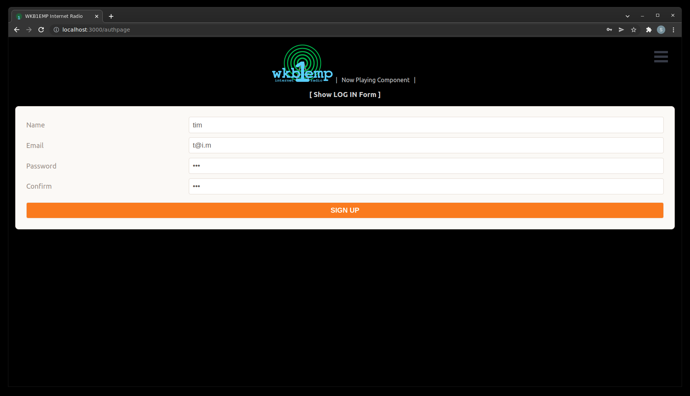
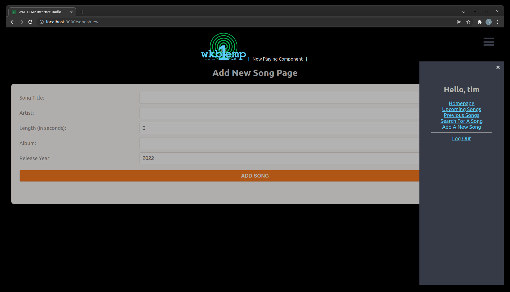
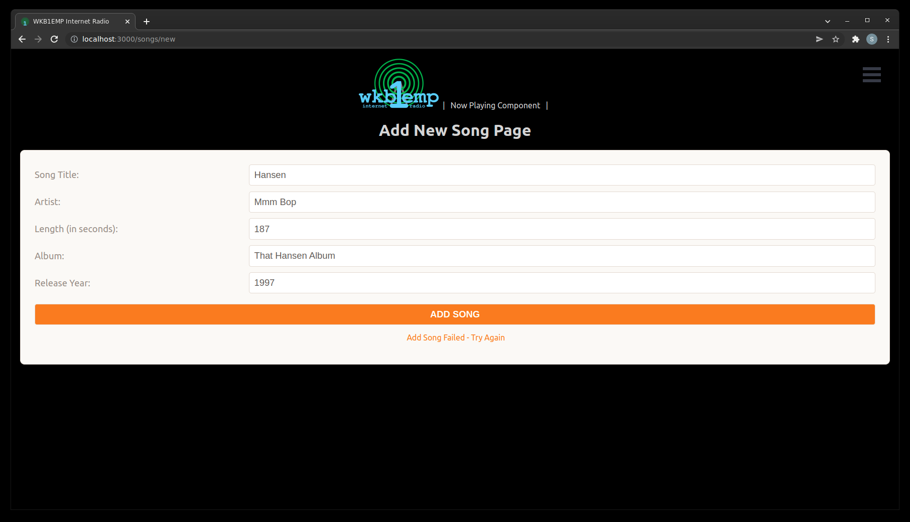

# WKB1EMP Internet Radio Station Automation System
WKB1EMP Internet Radio Station Automation System is an internet frontend for a traditional broadcast radio station. The concept is that listeners can come to the site, log in, and request songs to be played over the air. Other features include viewing a list of songs the station has played recently, viewing a list of requests coming up on the station, view details about a song in the station's database, and leave comments on the songs.

Presently the system does not have a backend to run as a standalone server, as there is no available broadcast radio station to attach the system to. Also, there is no database of actual music, as that is both a challenge in terms of data management, and potential copyright issues. A licensed radio station could easily integrate this software by building just a handful of additional components.

The app is designed to be easily extensible. One major future upgrade is to add a DJ scheduling system, so the music can only be selected by a specific user during a certain time period.

## Screenshots:

## Technologies Used:
- __MongoDB__
- __Express__
- __React__
- __Node__
- __Mongoose__
- __JavaScript__
- __HTML__
- __CSS__

## Getting Started:
View the app as deployed on Heroku: <https://wkb1emp.herokuapp.com/>

Check out the Trello board: <https://trello.com/b/Rc2O9myq/wkb1emp-internet-radio-station-automation-system>

## Next Steps:
- "Now Playing" function -- simulated
- Song comments
- DJ Scheduling Sytem
- Artist/Band Details
- Mobile design